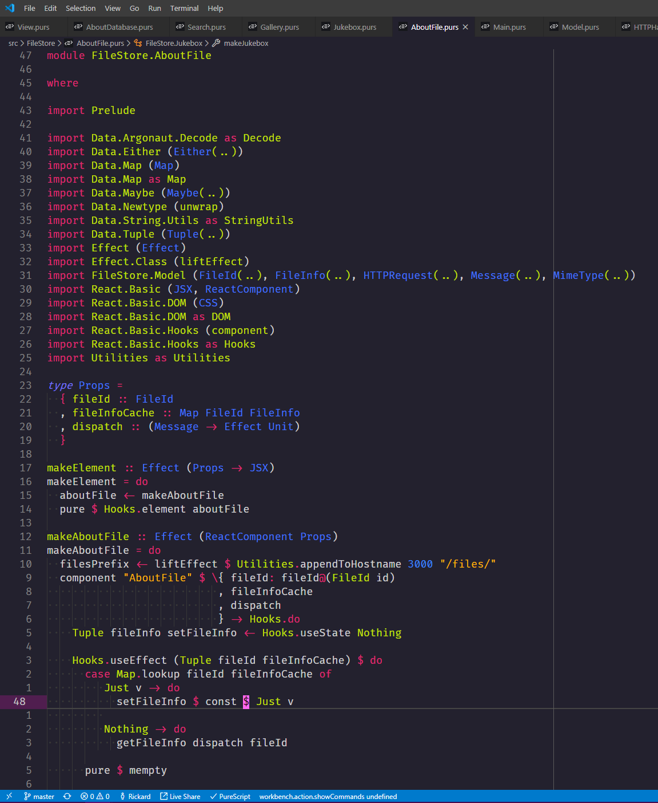
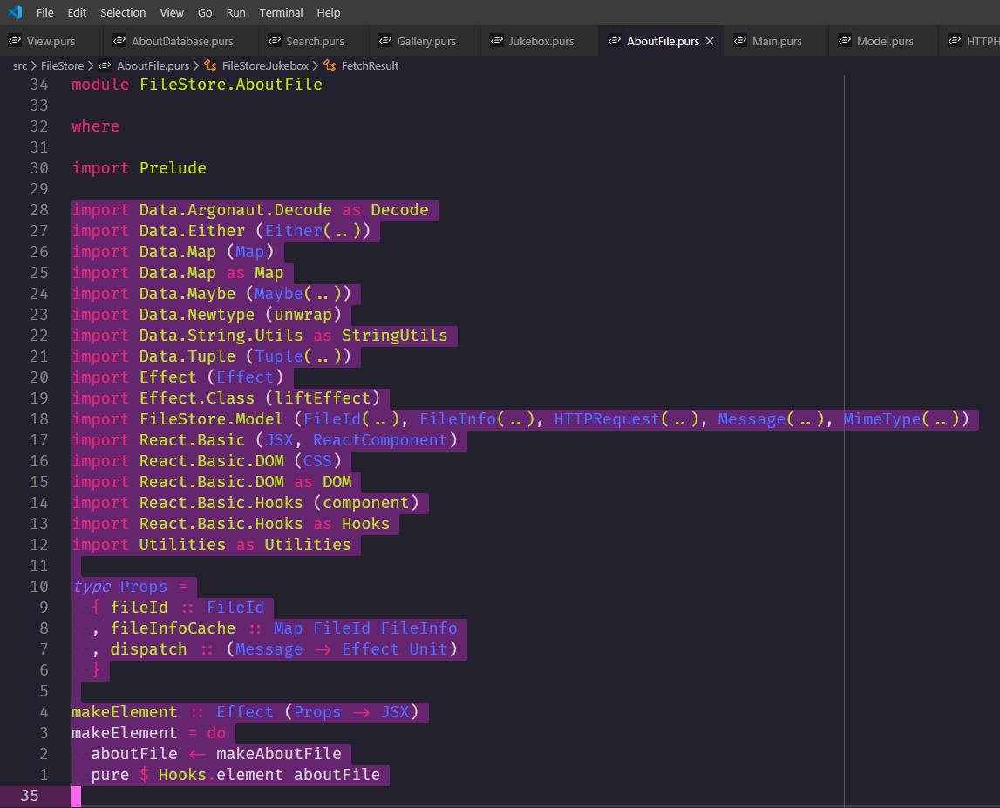
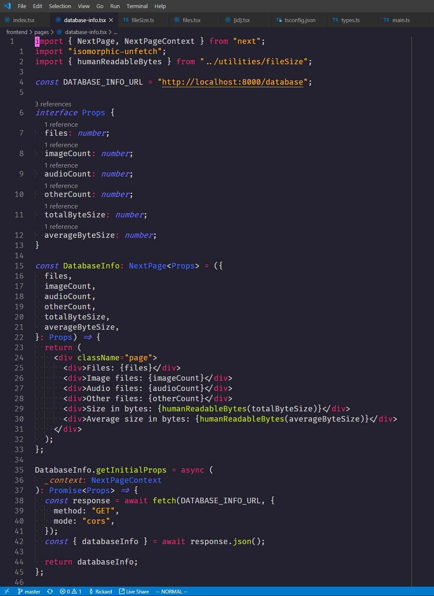
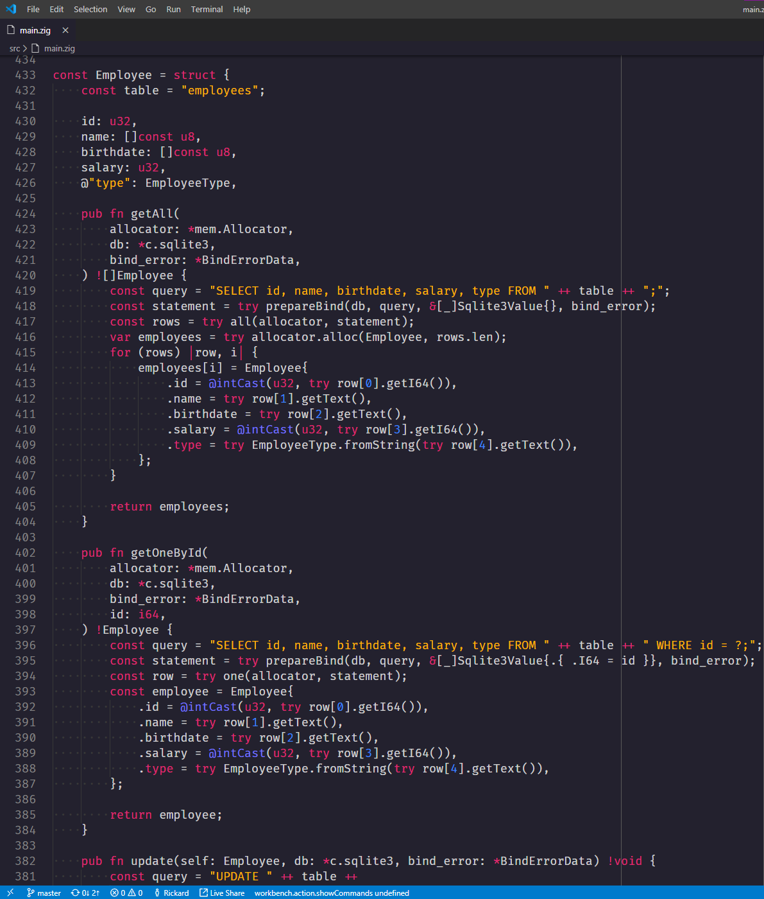
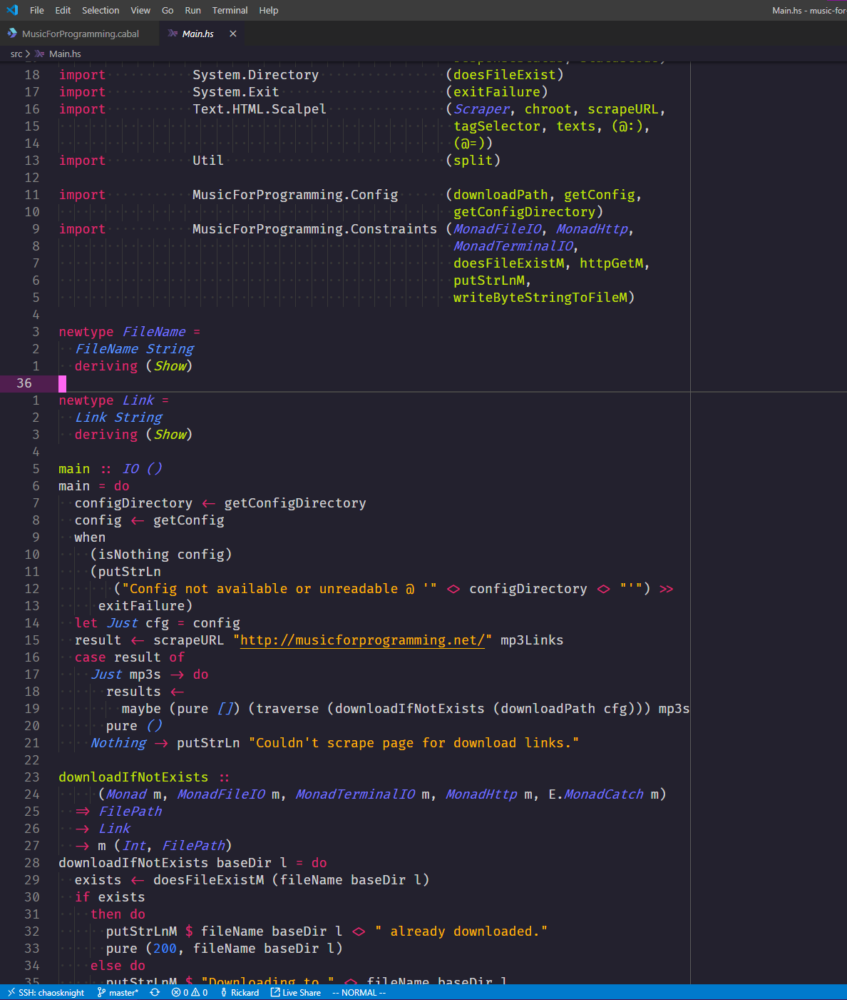

# Aurora GoNZooo

I was getting a bit tired of switching between themes that were all almost satisfactory,
so I decided to pick one that I liked the base of and go from there.

The result is this theme. It's mostly made to make PureScript look decent for now, though it was
originally made for Elixir and I use it for many other languages.

**Note**: While the theme was originally made for Elixir, changes over time in how it was generally
highlighted by syntax highlighting extensions may have changed the general look of it. I've not kept
up to date on these changes.

## PureScript

## TypeScript (with React)

## Zig

## Haskell

