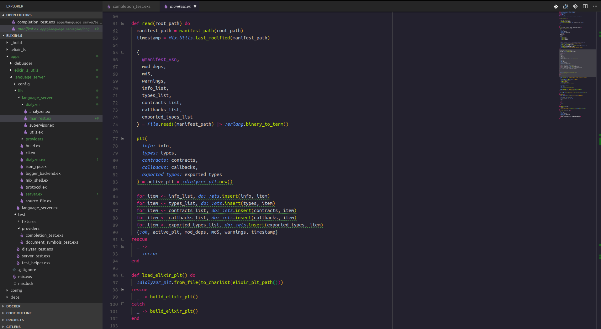
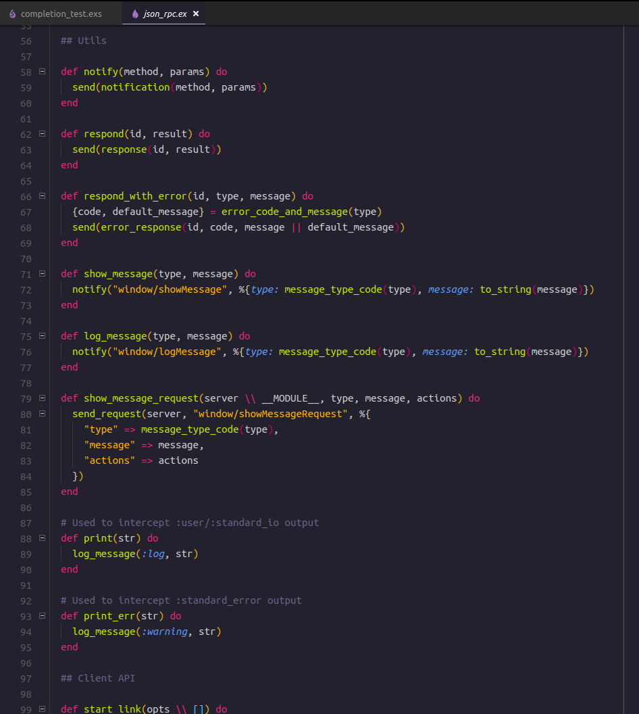
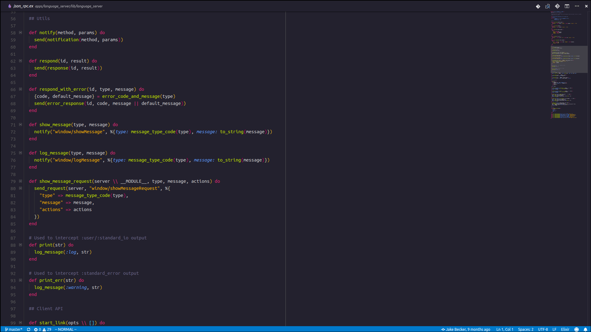
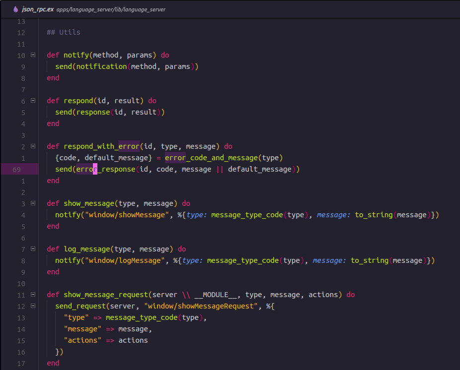

# Aurora GoNZooo

I was getting a bit tired of switching between themes that were all almost satisfactory,
so I decided to pick one that I liked the base of and go from there.

The result is this theme. It's mostly made to make Elixir look decent for now.

